# 汽车租赁网站

> 简易汽车借用系统，参与方包括：汽车拥有者，有借用汽车需求的用户
>
> 背景：ERC-4907 基于 ERC-721 做了简单的优化和补充，允许用户对NFT进行租借。
> - 创建一个合约，在合约中发行NFT集合，每个NFT代表一辆汽车。给部分用户测试领取部分汽车NFT，用于后面的测试。
> - 在网站中，默认每个用户的汽车都可以被借用。每个用户可以： 
>    1. 查看自己拥有的汽车列表。查看当前还没有被借用的汽车列表。
>    2. 查询一辆汽车的主人，以及该汽车当前的借用者（如果有）。
>    3. 选择并借用某辆还没有被借用的汽车一定时间。
>    4. 使用自己发行的积分（ERC20）完成付费租赁汽车的流程


作业提交方式为：**提交视频文件**和**仓库的链接**到指定邮箱。

## 如何运行


1. 在本地启动ganache应用。

2. 在 `./contracts` 中安装需要的依赖，运行如下的命令：
    ```bash
    npm install
    ```
3. 在 `./contracts` 中编译合约，运行如下的命令：
    ```bash
    npx hardhat compile
    ```
4. 在`./contracts`中运行合约，网络为ganache：

    ````
    npx hardhat run ./scripts/deploy.ts --network ganache
    ````
5. 复制输出的地址至`./frontend/src/utils/contract-addresses.json`中
6. 在 `./frontend` 中安装需要的依赖，运行如下的命令：
    ```bash
    npm install
    ```
7. 在 `./frontend` 中启动前端程序，运行如下的命令：
    ```bash
    npm run start
    ```

## 功能实现分析&项目运行截图


### 1. 连接MetaMask钱包中的账户并发行代币JF
    
#### 初始状态

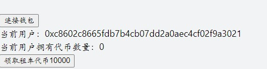

#### MetaMask签名

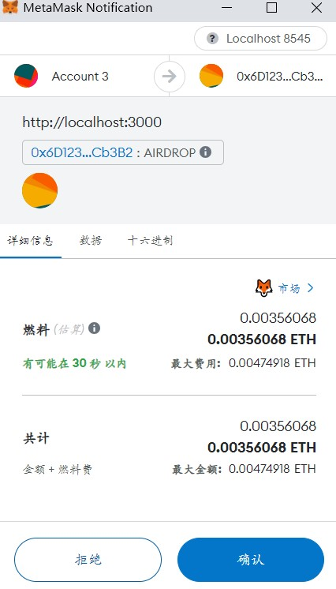

#### 结果

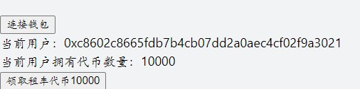

#### MetaMask中可看见JF代币


### 2. 领取新车（MetaMask签名）
#### 初始状态


#### 结果


### 3. 输入汽车id查询车主
#### 查询车主
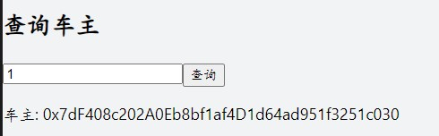
#### 查询不存在的车和未输入id时会弹窗提示
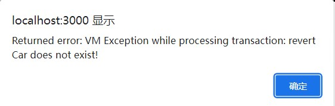


### 4. 点击按钮，查看空闲汽车（可借用汽车）list
#### 查看空闲汽车


### 5. 点击按钮，查看我的汽车list
#### 查看我的汽车


### 6. 输入汽车id借车
#### 请求定义支出上限


#### 签名，支付燃料

#### 成功借用（功能7中有查询截图）

#### 借用自己的车会弹窗提示


### 7. 输入汽车id查询借用者
#### 查询会显示借用者以及借用时间
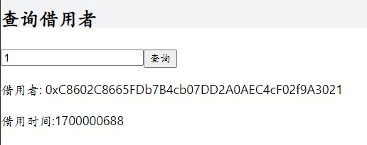
#### 查询不存在的车和未输入id时会弹窗提示，如功能3，此外车辆未被借用会弹窗提示
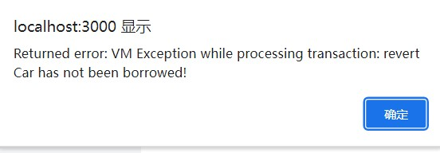

### 8. 输入汽车id还车
#### 同功能6，首先请求定义支出上限以及批准
#### 签名，支付燃料

#### 成功归还

#### 借用者原本代币数量
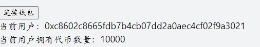
#### 借用者现在代币数量
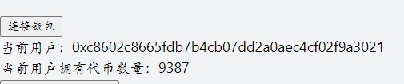
#### 借车者现在代币数量（原本为79），可以观察到借用者失去的代币数量与借车者得到的代币数量相当
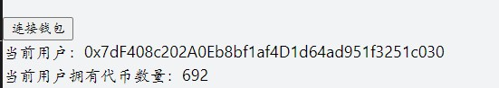
#### 此外，代币数量不足时会弹窗提示

### 9. ganache截图
#### 启动ganache
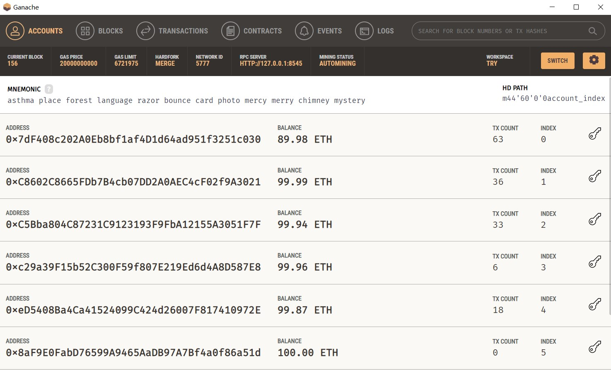
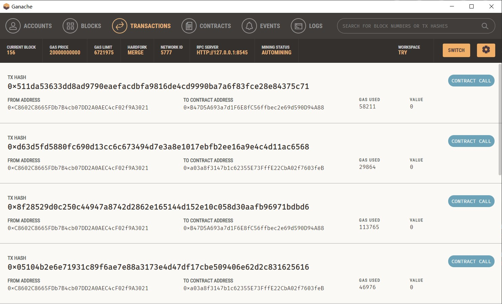
#### 借车者和合约的交易记录


## 参考内容

- 课程的参考Demo见：[DEMOs](https://github.com/LBruyne/blockchain-course-demos)。

- ERC-4907 [参考实现](https://eips.ethereum.org/EIPS/eip-4907)

